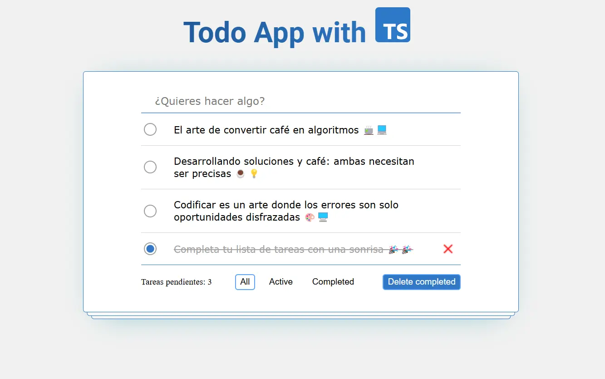

# 🗒️ Todo App built with React and Typescript

Este es una Todo App intuitivo y sencillo, donde se permite realizar operaciones CRUD básicas y tener una lista de tareas almacenadas en el LocalStorage para mantener una lista de tareas organizadas.

## Instalación y ejecución

Puedes clonar el repositorio o descargar el archivo ZIP del proyecto.

1. **Clonar el repositorio:**
  ```bash
    git clone https://github.com/Usuario6842/react-todo-app-ts.git
  ```

2. **Descargar el archivo ZIP:**

   [Descargar ZIP](https://github.com/Usuario6842/react-todo-app-ts/archive/refs/heads/main.zip)

3. **Instalar dependencias:**

   puedes navegar hasta la ruta "/" y ejecuta: 
  ```bash
    pnpm install
  ```

4. **Iniciar la aplicación:**

   para iniciar la aplicación ejecuta el siguiente comando: 
  ```bash
    pnpm run start
  ```

5. **Ejecutar la aplicación en modo desarrollo:**

   para iniciar la aplicación en el modo de desarrollo ejecuta el siguiente comando: 
  ```bash
    pnpm run dev
  ```

### Demostración
<a href="https://todo-app-ts-beta.vercel.app" target="_blank"><strong>🚀Live Demo</strong></a>

## Vista Previa
<div align="center">
  
</div>

### ¡Gracias por tu interés!

¡Espero que lo disfrutes. Si tienes alguna duda o sugerencia, no dudes en contactarme. 💚💚💚
